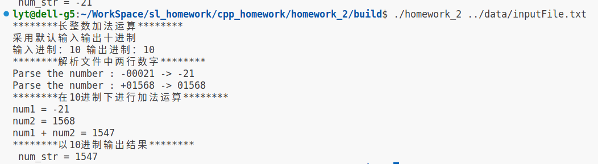
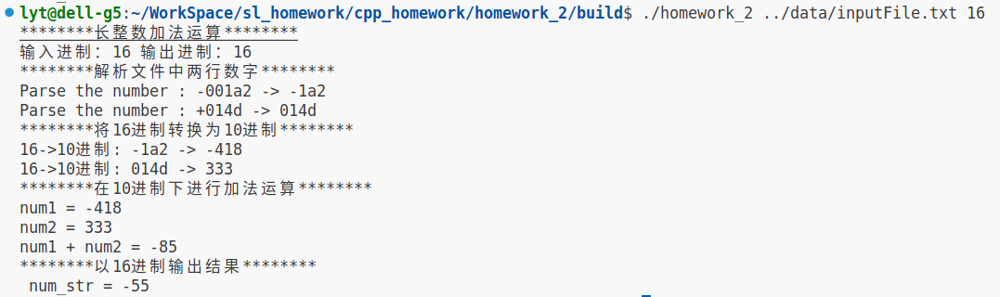
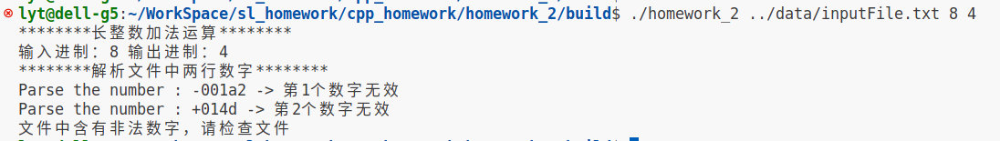
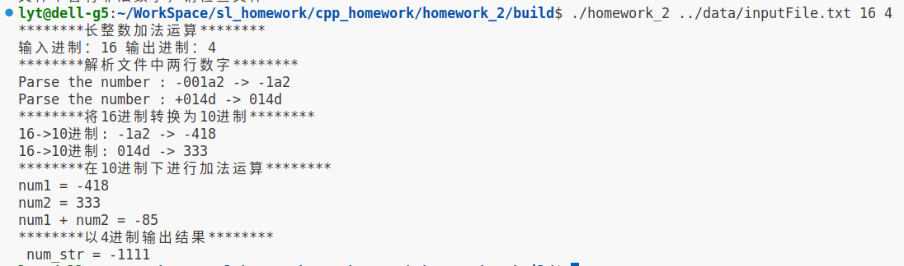

## 第二次作业——长整数加法

### 1.编译步骤

```bash
cd build
cmake ..
make
```

### 2. 运行步骤

#### 项目1：

`inputFile.txt`文件中两行数字可为`001253`,`+0253`,`-1508`,`-00568`等形式的十进制数字

运行指令：

```bash
./homework_2 ../data/inputFile.txt
```

运行结果



#### 扩展1：

`inputFile.txt`文件中两行数字可为`001a2`,`+04d`,`-1508`,`-00568`等形式的指定输入进制的数字，若`inputFile.txt`中的数字与输入进制不符会提示。

输入的指定进制可以是2~36之间，默认输出进制与输入进制相同

运行指令：

```bash
./homework_2 ../data/inputFile.txt 16
```



#### 扩展2：

同理，`inputFile.txt`文件中两行数字可为`001a2`,`+04d`,`-1508`,`-00568`等形式的指定输入进制的数字，若`inputFile.txt`中的数字与输入进制不符会提示。

举例如下：



输入输出的指定进制可以是2~36之间

运行指令：

```bash
./homework_2 ../data/inputFile.txt 16 4
```



代码中还对`+0`,`0000`,`+000`,`-0000`类似的数字做了处理，均能满足任务需求。

#### 暂存疑问

目前还有点疑惑就是，不知怎么处理溢出这种情况，比如"+10000000000000000000000"这种输入的长数字。